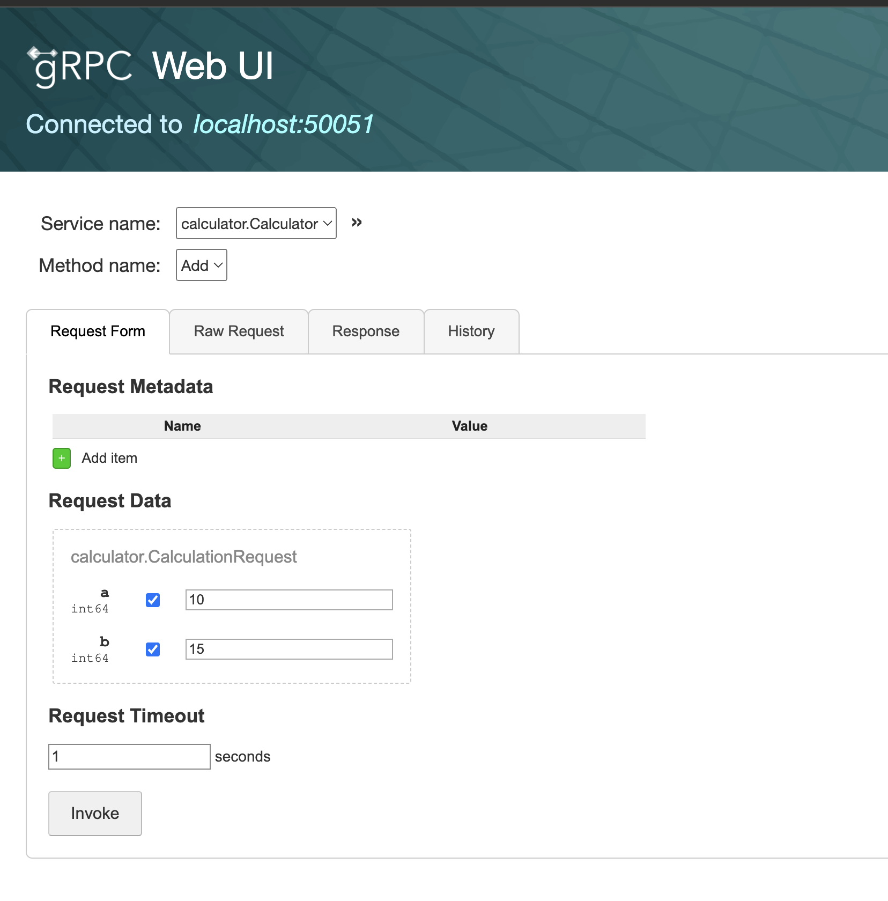
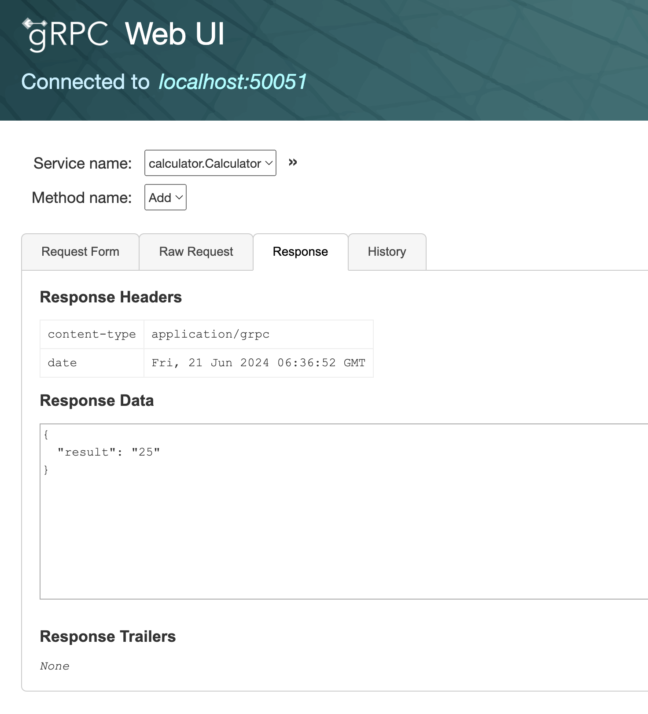
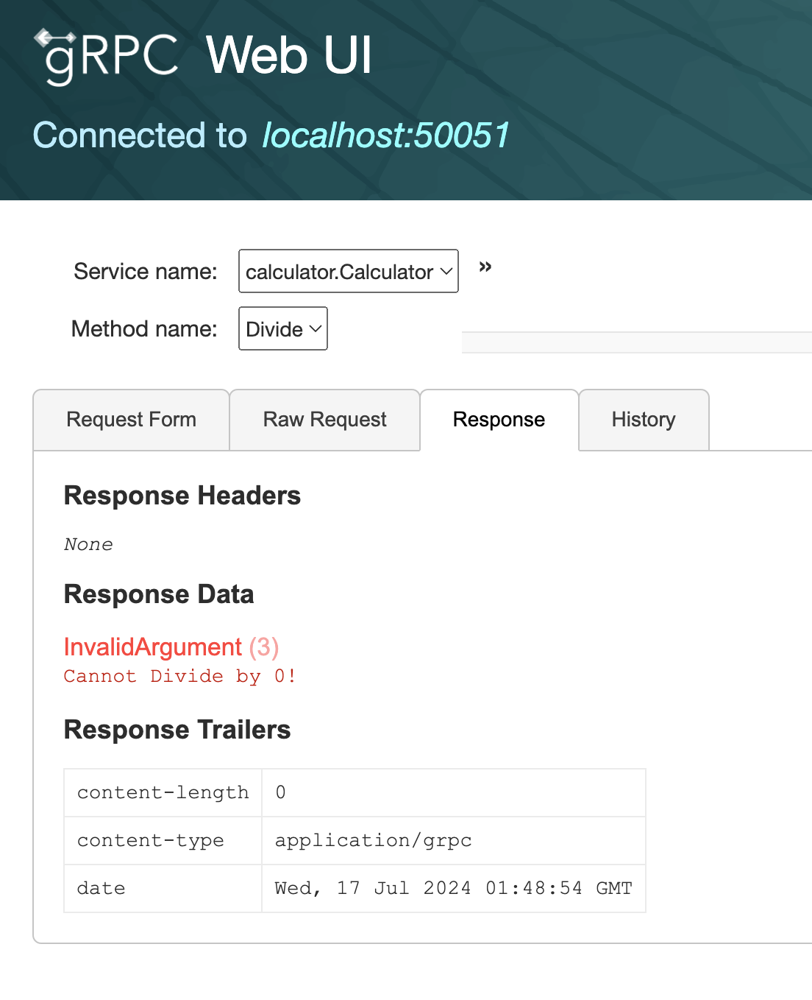

# grpc-calculator

A simple Add calculator built using the gRPC in rust with tonic.

This sample project also aims to implement a model gRPC API service in rust.

## Running the project
Server:
```sh
❯❯❯ cargo run --bin server
    Finished `dev` profile [unoptimized + debuginfo] target(s) in 0.08s
     Running `target/debug/grpc-calculator`
Got a request: Request { metadata: MetadataMap { headers: {"content-type": "application/grpc", "user-agent": "grpcurl/1.8.7 grpc-go/1.48.0", "te": "trailers"} }, message: CalculationRequest { a: 3, b: 2 }, extensions: Extensions }
Got a request: Request { metadata: MetadataMap { headers: {"content-type": "application/grpc", "user-agent": "grpcurl/1.8.7 grpc-go/1.48.0", "te": "trailers"} }, message: CalculationRequest { a: 3, b: 2 }, extensions: Extensions }
Got a request: Request { metadata: MetadataMap { headers: {"content-type": "application/grpc", "user-agent": "grpcurl/1.8.7 grpc-go/1.48.0", "te": "trailers"} }, message: CalculationRequest { a: 1, b: 2 }, extensions: Extensions }
...
...
```

Client:
```sh
❯❯❯ cargo run --bin client
   Compiling grpc-calculator v0.1.0 (/Users/jaydihenkar/work/rust_learning/grpc-calculator)
    Finished `dev` profile [unoptimized + debuginfo] target(s) in 0.51s
     Running `target/debug/client`
Got response: 55
```

# Additional Utilities

Some gRPC helper utilities:
- grpcurl (`brew install grpcurl`)
- grpcui (`brew install grpcui`)


## `grpcurl` usages
With proto:
```sh
> grpcurl -plaintext  -proto ./proto/calculator.proto -d '{"a": 1, "b": 2}' 'localhost:50051' calculator.Calculator.Add
{
  "result": "3"
}
```

Without proto reference when server supports reflection:
```sh
> grpcurl -plaintext  -d '{"a": 3, "b": 2}' 'localhost:50051' calculator.Calculator.Add
{
  "result": "5"
}
```

List with grpcurl:
```sh
> grpcurl -plaintext 'localhost:50051' list
calculator.Calculator
grpc.reflection.v1alpha.ServerReflection
```

Error handling with the gRPC status for Bad Data
```sh
❯❯❯ grpcurl -plaintext  -d '{"a": 3, "b": 0}' 'localhost:50051' calculator.Calculator.Divide
ERROR:
  Code: InvalidArgument
  Message: Cannot Divide by 0!
```

## `grpcui` usages

Invoke the gRPC UI on the server -
```sh
❯ grpcui -plaintext 'localhost:50051'
gRPC Web UI available at http://127.0.0.1:61153/
```

UI for request:


Response on UI:


gRPC UI for Invalid Data:

